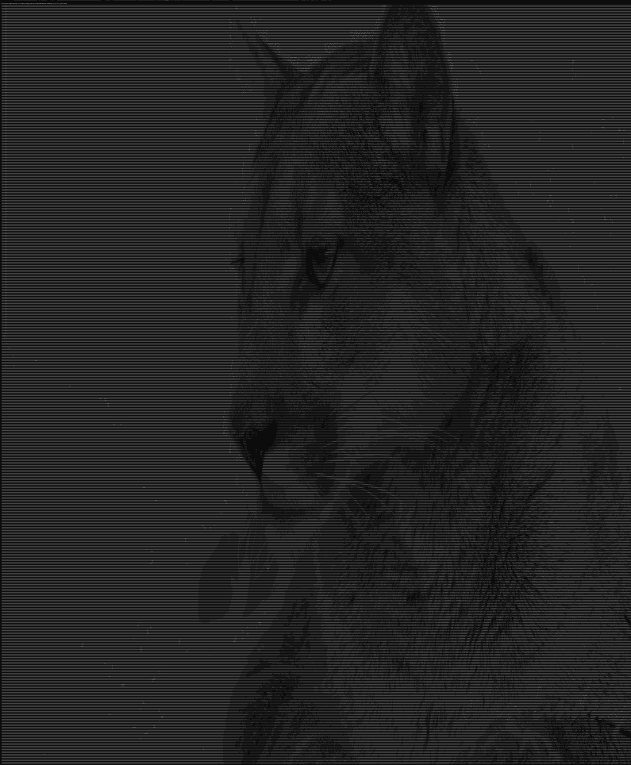

# comsolBmpPrint
 Программа для вывода ч/б изображений в консоль

При запуске можно передать как абсолютный путь к изображению, так и просто имя изображения, если оно лежит в директории с исполняемым файлом.

Изображение в градациях серого также выведется в консоль корректно.

Оригинальное изображение:

Отображение в консоли:

